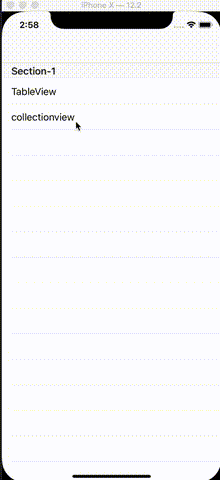

# JMEmptyAnimateView
## 效果


## 使用方式

```
#pragma mark - 实例化适配器
-(JMEmptyAnimatedBaseObject *)adapter{
    if (!_adapter) {
        _adapter = [[JMEmptyAnimatedBaseObject alloc] init];
        _adapter.defautlCellIdentiy=@"cell";//设置默认cell Identiy
    }
    return _adapter;
}

```
```
基类继承 让cell 继承JMEmptyCollectionViewCell/JMEmptyTableViewCell
且嵌入:
```
```
-(UICollectionViewCell *)collectionView:(UICollectionView *)collectionView 
cellForItemAtIndexPath:(NSIndexPath *)indexPath{
  ....
  ` cell.isAnimation = NO; `
 ....  
}
```
``` 
 //开始
   [self.adapter startAnimated:tmpView]; 
 	OR
   [self.adapter startViewControllerAnimated:self];
```
``` 
//结束
	[self.adapter endAnimation];
	OR
	[self.adapter endViewControllerAnimation];
``` 
## 设计原理
//有空再写，have fun

